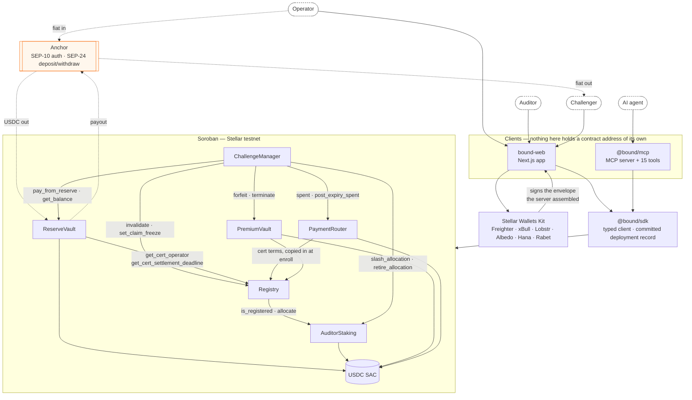
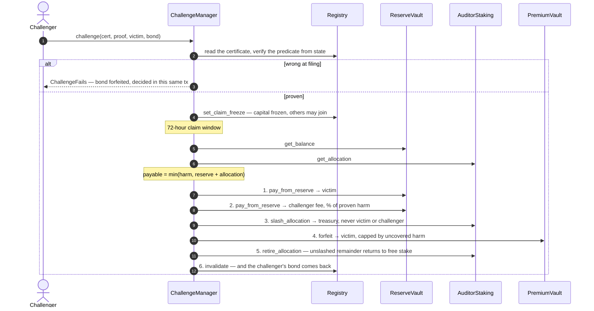

# Bound Protocol

> **A surety bond for AI agents, on-chain.**
> Originally built for the Build On Stellar Hackathon — IBW 2026 Istanbul.
> Now submitted to the Rise In × Stellar **Pro Hackathon 2026, Scale Track**.

Know your worst case _before_ you transact. AI agents now hold wallets and move money
autonomously, but reputation can't tell you your maximum downside — models change
silently and a fresh identity is free. Bound Protocol replaces the unanswerable
_"can I trust this agent?"_ with a number you can look up:

> **"Your worst-case loss is bounded at $X, it's pre-funded, and an independent auditor
> staked their own money that this is true."**

---

|                   |                                                                                                                                                                 |
| ----------------- | --------------------------------------------------------------------------------------------------------------------------------------------------------------- |
| **Live demo**     | [www.boundprotocol.dev/app](https://www.boundprotocol.dev/app) — browse bonded agents, publish and fund a certificate, attest one                               |
| **Documentation** | [docs.boundprotocol.dev](https://docs.boundprotocol.dev)                                                                                                        |
| **SDK**           | [`@bound/sdk`](https://www.npmjs.com/package/@bound/sdk) — typed client for the whole lifecycle                                                                 |
| **MCP connector** | [`@bound/mcp`](https://www.npmjs.com/package/@bound/mcp) — 15 tools for any MCP-capable agent                                                                   |
| **Quickstart**    | [`docs/QUICKSTART.md`](./docs/QUICKSTART.md) — reproducible from a clean clone                                                                                  |
| **What is built** | [`docs/DELIVERABLES.md`](./docs/DELIVERABLES.md) — per-requirement audit, checked against source                                                                |
| **Trust model**   | [`docs/THREAT-MODEL.md`](./docs/THREAT-MODEL.md) and the [disclosed defects](https://docs.boundprotocol.dev/docs/trust-model#defects-in-the-deployed-contracts) |

### Repositories

|                                                         |                                                         |
| ------------------------------------------------------- | ------------------------------------------------------- |
| [`bound`](https://github.com/iamnotdou/bound)           | this repo — contracts, SDK, MCP connector, demo scripts |
| [`bound-web`](https://github.com/iamnotdou/bound-web)   | the marketing site and the app at `boundprotocol.dev`   |
| [`bound-docs`](https://github.com/iamnotdou/bound-docs) | the documentation site at `docs.boundprotocol.dev`      |

Testnet only. Amounts are testnet USDC and no mainnet deployment exists.

## How it works

1. **Lock the reserve.** The operator locks real USDC in a vault. It's the pre-funded
   payout, and it can't be withdrawn until the certificate expires.
2. **An auditor vouches — with their own money.** The instant they attest, their stake
   locks to the certificate. If the vouch is false, they lose it.
3. **Read before you transact.** Any counterparty calls `verify(agent)` and sees the
   bound, the locked reserve, the auditor's stake, and the status.
4. **Anyone can catch a lie — and gets paid.** If the reserve is short, the contract
   proves it itself and slashes the auditor in one transaction: 80% to the victim,
   20% to whoever caught it. No oracle. No judge. Just arithmetic.

The honest edge: a **short reserve** is provable on-chain with zero trusted parties.
Proving _who was harmed_ or _how much an agent spent_ can't be — those name a victim
or fall back to a named arbiter. The certificate tells you which is which.

Contributing, or pointing an agent at this repo? Start with
[`AGENTS.md`](./AGENTS.md) — commands, prohibitions, and the definition of done.

Full documentation lives in [`docs/`](./docs):

| Document                                   | What it covers                                      |
| ------------------------------------------ | --------------------------------------------------- |
| [`docs/WRITEUP.md`](./docs/WRITEUP.md)     | The academic framing, developer docs, and narrative |
| [`docs/PROJECT.md`](./docs/PROJECT.md)     | The build plan, trust model, and known limitations  |
| [`docs/RESOURCES.md`](./docs/RESOURCES.md) | Reference material and external links               |

---

## Architecture

Seven Soroban (Rust) contracts on Stellar Testnet, a published TypeScript SDK, a
published MCP connector, and a Next.js app in its own repo. All value moves in
USDC — the testnet Circle SAC — and no contract holds a key: every write is
authorised by the actor it belongs to.

```
contracts/
├── registry/            # Certificates: publish, attest, verify, invalidate, freeze
├── reserve-vault/       # The operator's locked USDC, walled off per certificate
├── auditor-staking/     # The auditor's stake, allocated per certificate, slashable
├── challenge-manager/   # Four proof types, the claim window, and settlement
├── payment-router/      # SEP-41 wrapped USDC that meters spend per certificate
├── premium-vault/       # Coverage premiums, accruing to the auditor as yield
├── fee-escrow/          # Deployed but unused — superseded by premium-vault
├── spend-probe/         # Never deployed: the executable proof that spend ≠ loss
└── integration-tests/   # Offline cross-contract harness

bindings/                # Generated TypeScript clients — never hand-edited
packages/sdk/            # @bound/sdk — the publishable typed client
packages/mcp/            # @bound/mcp — the agent tools, packaged as an MCP server
scripts/                 # setup, deploy, demo, evidence, anchor, and the smoke suites
deployments/             # testnet.json — the single source of truth for addresses
```

### System



The dotted edges are the fiat rail: a reserve funded from a SEP-24 deposit, and a
proven claim paid out through a SEP-24 withdrawal. That is the boundary the
protocol is only useful across — a surety bond whose collateral cannot be funded
from, or redeemed to, money people actually spend is not a bond.

### Settlement

The part worth reading closely. One rule, applied identically to every proof
type, with the pots drawn in a fixed order:



Every line closes a specific attack; the reasons are attached to them in
[`contracts/challenge-manager/src/lib.rs`](./contracts/challenge-manager/src/lib.rs).
The one that matters most: **the auditor's slash goes to the treasury, never to
the victim or the challenger.** A colluding operator who files a challenge
against their own certificate must not be able to collect the auditor's stake.

### The claim the protocol refuses to make

`PaymentRouter::spent(cert_id)` is **gross routed flow, not loss**. The
arithmetic cannot be forged, so `spent > bound` is a sound predicate — and a
worthless settlement rule, because one dollar shuttled between two addresses the
same operator controls drives the counter past any bound for the price of gas.
[`contracts/spend-probe`](./contracts/spend-probe) is the executable proof and is
kept in the workspace for that reason. Anything that pays out is sized by harm
proven to a party outside the operator's control, and capped by the collateral
actually behind the certificate.

## Deployed contracts (Stellar Testnet)

Generated from [`deployments/testnet.json`](./deployments/testnet.json), which the
deploy script owns and `@bound/sdk/deployments` publishes. `test/docs-integrity.test.ts`
fails if this table and that record ever disagree, so an address here is an address
you can paste into an explorer.

| Contract         | Address                                                    | What it does                                                                   |
| ---------------- | ---------------------------------------------------------- | ------------------------------------------------------------------------------ |
| Registry         | `CCJTY2VYHQZ7OQE6NX7QFL7JL766YMTNKGHZXGAPTPKV5IUS2AK5UREF` | Certificates. `publish` → `attest` → `verify`.                                 |
| ReserveVault     | `CD6VK2YUUZO5L5R76DNT3NQNWR2UCALPQ3T6STWAQSEY7Q6I5P4LAFC3` | The operator's locked USDC, walled off per certificate.                        |
| AuditorStaking   | `CBPUCSASKMQKRWJ7WUTQ6KUPX66QUBV2E6V4CQ46BI4ZLJSW6AFPR6RB` | The auditor's own stake, allocated per certificate and slashable.              |
| ChallengeManager | `CAYEGPIHNDIEONWNKRF2UPTO32SXGFTLBQ2K4RPN2LCIGOOZYLYYYIHY` | Four proofs, a 72-hour claim window, pro-rata settlement.                      |
| PaymentRouter    | `CA5OPBLVGNPAFNFHY3ATNZXJ72L3K4EG4RIQYOWOKESAN7C75DDMMCMJ` | SEP-41 wrapped USDC that meters an enrolled agent's spend.                     |
| PremiumVault     | `CA5JT2IBPY7X4QZS65XY6YW2BXDUEFPZHXTNG2OCPCJTOM4DWEWEOHAF` | Coverage priced bound × duration, accruing to the auditor as yield.            |
| FeeEscrow        | `CAM3D5PTXQ4MEY45SGNUZZGNN2D6JXHSCFR3IM6S46KCPWERWJGDFXNI` | Deployed but unused — superseded by PremiumVault, kept rather than redeployed. |
| USDC             | `CDIQ4564SFRCLBP2UL4Z5IBGEBDF2J5ISQVCTHN3F5SNVDXGSB5YEAMM` | The testnet Circle Stellar Asset Contract. Every amount moves in this token.   |

Deployed 2026-08-21 from commit [`82e34af8b9e8`](https://github.com/iamnotdou/bound/commit/82e34af8b9e8b4456623b46bda4b32016f8abc4f).
Read-only simulations use the funded source account `GDOUNKJLAMAPLK7IZ2MGBE3S4RHF4SSQYPDRCGK2VNSP6IHFR5OQ7HGF`.

---

## Stellar Skills used

The [official skill files](https://skills.stellar.org/) that bear on the code in
this repo, cited by path as the submission requires. Each line names the part of
the codebase it applies to, so a reader can check the claim rather than take it.

| Skill file                  | Where it applies                                                                                                                                                                                                                                                                                                          |
| --------------------------- | ------------------------------------------------------------------------------------------------------------------------------------------------------------------------------------------------------------------------------------------------------------------------------------------------------------------------- |
| `skills/anchors/SKILL.md`   | [`scripts/anchor-deposit.ts`](./scripts/anchor-deposit.ts), [`scripts/anchor-status.ts`](./scripts/anchor-status.ts), [`scripts/anchor-trustlines.ts`](./scripts/anchor-trustlines.ts) — SEP-10 challenge/sign/JWT, the SEP-24 interactive deposit, and the classic trustline the anchor's asset needs before it can land |
| `skills/standards/SKILL.md` | The SEP choices themselves: SEP-41 for [`contracts/payment-router`](./contracts/payment-router), SEP-10/24 for the fiat rail, and why `transfer` may make no sub-invocation                                                                                                                                               |

Two more are relevant to work in flight rather than to code already here, and are
cited only if they end up in the diff: `skills/integration-finder/SKILL.md` for
choosing the second ecosystem integration, and `skills/soroswap/SKILL.md` if the
TRY↔USDC swap at the anchor boundary lands.

## Key design decisions and trade-offs

Each of these cost something. The cost is stated, because a decision presented
without its price is a decision nobody can evaluate.

**A slash pays the treasury, never the victim or the challenger.**
`settle_fraud` draws the victim's compensation and the challenger's fee
(`CHALLENGER_FEE_BPS`, 10% of proven harm) from the _operator's own reserve_, and
sends the auditor's slashed allocation somewhere neither party can reach.
Otherwise an operator files a challenge against their own certificate, names an
address they control as the victim, and collects the auditor's stake for the
price of a bond. **The cost:** a victim whose harm exceeds the reserve is not
made whole out of the auditor's capital, even though that capital was slashed.
Bound bounds the loss; it does not always cover it.

**The spend counter is evidence, not a payout trigger.**
`PaymentRouter::spent(cert_id)` cannot be forged, so `spent > bound` is a sound
predicate — and a worthless settlement rule, because a single dollar shuttled
between two addresses one operator controls drives the counter past any bound for
the price of gas. `contracts/spend-probe` is the executable proof and is kept in
the workspace for no other reason. **The cost:** `BoundExceeded` settles in
hygiene mode only — it can kill a certificate, not pay out on one.

**The router custodies USDC instead of wrapping the SAC.**
x402 facilitator settlement requires that paying for a resource is exactly one
`transfer` call emitting exactly one event with no sub-invocations. A router that
called through to the underlying SAC would emit two and break settlement, so it
holds the asset and moves internal balances. **The cost:** a custodial contract
is a larger thing to trust than a passthrough. Mitigated, not eliminated, by a
per-certificate `float_cap` that bounds what a stolen agent key can reach, and by
the operator's `halt` — and `transfer` may therefore make no cross-contract call
at all, so everything the hot path needs is copied into router storage at
`enroll`.

**Capital unlocks at the settlement deadline, not at expiry.**
A proof about post-expiry conduct only becomes provable _after_ expiry. If the
reserve and the auditor's allocation both unlocked at `expires_at`, such a proof
would settle against an empty pot every single time, so both read
`expires_at + CHALLENGE_WINDOW_SECONDS`. **The cost:** an honest operator's
capital is locked seven days longer than the cover it bought.

**Money is walled off per certificate, not pooled.**
`Balance(cert_id)`, `Allocation(cert_id)`, `Coverage(cert_id)`. Funding one
certificate can never back another, and one bad certificate cannot destroy an
auditor's whole book. **The cost:** capital efficiency. An auditor with ten
certificates cannot let a quiet one's allocation absorb a loud one's claim.

**A claim opens a window rather than paying immediately.**
A proven challenge freezes the certificate for `CLAIM_WINDOW_SECONDS` (72 hours)
and every admitted claim settles together, pro rata. Paying the first filer in
full would make fraud detection a race, and the fastest bot would collect a
collateral pool that other victims also have a claim on. **The cost:** a real
victim waits three days, and a claim below `DE_MINIMIS_FLOOR_BPS` of the bound is
not admitted at all.

**Two published packages, one definition of the agent tools.**
`packages/mcp/src/tools.ts` is the only place a tool is defined. The `bound-mcp`
executable and any AI-SDK loop are adapters over it, and a consumer imports
`@bound/mcp/tools` — a second entry point carrying the table without the server —
so a Next build never bundles an MCP server. **The cost:** the package cannot
reach into an app for credentials, so it carries its own `accounts.ts` reading
the same five environment variables. Thirty duplicated lines is the price of the
package standing on its own.

**The anchor is configuration, not code.**
`ANCHOR_HOME_DOMAIN` names one and every endpoint is read from its
`stellar.toml` over SEP-1. **The cost:** an extra network round trip before any
SEP-10 or SEP-24 call, cached for sixty seconds — short enough that a rotated
signing key is not trusted for long.

**A failed read is `null`, never `0`.**
"The vault said nothing" and "the vault holds nothing" are different claims about
money, and a UI that renders the first as the second is lying with a plausible
number. Every chain read in the app degrades independently. **The cost:** more
branches in every component — `SpendMeterPanel` and `CoveragePanel` each render
three shapes rather than one shape with blanks.

---

## Technical challenges, and how they were solved

**A well-formed envelope that could never succeed.**
`AssembledTransaction.toXDR()` serialises whatever was assembled, _including an
assembly whose simulation failed_. Verified against the deployed contracts:
attesting an unfunded certificate, attesting as an unregistered auditor, and
funding someone else's reserve all produced perfectly valid XDR. The build
route's comment claimed the simulation caught those. It did not.
`assertSignableXdr` re-simulates the envelope **as assembled** — carrying its
auth entries, which is what makes it fail the cases the first simulation let
through — and separately refuses any envelope needing a signature the connected
wallet does not hold. One extra RPC round trip, in exchange for never asking
somebody to sign a transaction that cannot land.

**A transaction reported as rejected while the money was gone.**
`/api/tx/submit` polls for thirty seconds and then throws, and the UI rendered
that as "the network rejected this" — for transactions that, more often than not,
landed a few seconds later. The hash is a property of the _signed envelope_, so
it is knowable before the network sees it: `bound-web/lib/tx-journal.ts` writes it down
first, and `GET /api/tx/[hash]` asks the chain what actually happened. `NOT_FOUND`
is returned as a status rather than an error, because "never seen" and "failed"
are different facts.

**State archival aborts the transaction instead of returning a default.**
Soroban reclaims instance and persistent entries whose TTL lapses, and _reaching_
one aborts rather than returning zero — so an untouched certificate would stop
being readable, and each contract instance is on the same clock, which would take
a whole contract offline. Every write path now bumps to 120 days with a threshold
at 60, sized against a certificate's own lifetime plus its challenge window, and
the rent is charged to whoever was already paying for that call. The app detects
the residual case by identity (`AssembledTransaction.Errors.ExpiredState`, not a
string match) and tells "never issued" apart from "reclaimed" by reading the
certificate count, which is a separate entry that survives either way.

**Two of the generated bindings are real, unrelated packages on npm.**
The Stellar CLI names them `registry` and `usdc`. Declaring either as a
dependency would fetch a stranger's code, so the SDK imports all of them by
relative path — which means a plain `tsc` would emit those specifiers into
`dist/` and publish a package importing files outside its own tarball. tsup
inlines them instead, and the `external` patterns are regexes rather than strings
so the `@stellar/stellar-sdk/contract` and `/rpc` subpaths are not silently
bundled too.

**Two lockfiles resolved two different major versions.**
The repo once carried both a `package-lock.json` and a `pnpm-lock.yaml`, which
resolved `@stellar/stellar-sdk` 13.3.0 and 16.x respectively — and only one of
those trees produces envelopes a wallet can sign. `bound-web/lib/toolchain.test.ts` now asserts 16.x on both resolution paths, the app's and the SDK's,
because the two resolve it independently.

**Asking a wallet to sign something a third party wrote.**
A SEP-10 challenge arrives from the anchor. Before it reaches a wallet the server
proves it is genuinely a challenge — `readChallengeTx` against the anchor's
declared `SIGNING_KEY`, sequence zero, the home-domain operation, the anchor's own
signature — and refuses a challenge minted for a different account. The subtlety
that cost the most: SEP-10's `web_auth_domain` is the host of `WEB_AUTH_ENDPOINT`,
**not** the home domain. They coincide on the reference anchor, so validating
against the home domain looks correct and silently breaks against any anchor that
serves auth elsewhere.

**An anchor that moves ten dollars at a time.**
The reference anchor caps every transfer at 10 units while the protocol's
defaults are written in hundreds — a $500 minimum auditor stake cannot be reached
through it. `BOUND_AMOUNT_SCALE` divides every USDC figure in the deploy and demo
scripts by one factor, so each ratio the assertions depend on survives:
`DE_MINIMIS_FLOOR_BPS` is in basis points and scales with the bound rather than
against it. Unset, every script behaves exactly as before.

**One helper import that would have shipped the chain SDK to the browser.**
Fixing a gating bug, a pure function was imported from `bound-web/lib/anchor.ts` into a
Client Component — and that module reads `process.env` at module scope and
imports `@stellar/stellar-sdk` for challenge validation. The arithmetic now lives
in `bound-web/lib/anchor-limits.ts`, which imports nothing; `bound-web/lib/anchor.ts` re-exports it so
there is still one definition. Confirmed against the built output rather than
assumed: the chunk carrying the panel is 20 KB and contains no SDK internals.

## Running it

```bash
pnpm install
pnpm verify            # everything CI runs — offline, no secrets, ~6s
```

`pnpm verify` is the definition of done: typecheck, lint, formatting, unit
tests, and the contract fmt/clippy/test suites. It needs no network and no
credentials, so a fresh clone can run it immediately.

The individual pieces, if you want to run one on its own:

```bash
# TypeScript
pnpm test              # unit tests, offline
pnpm typecheck
pnpm lint              # eslint .
pnpm format:check      # prettier

# Contracts
pnpm test:contracts    # cargo test — 21 tests across 5 contracts
pnpm lint:contracts    # cargo clippy -D warnings
pnpm build:contracts   # 5 wasm artifacts
```

Two commands spend testnet funds and mutate on-chain state, so they are kept
out of `verify` and are never automated. Both need `.env.testnet`:

```bash
pnpm test:e2e          # 5 live smoke suites against testnet
pnpm demo              # 8-step: stake → reserve → fee → attest → publish → verify → pay → SLASH
```

Contract addresses and network endpoints are committed in
[`deployments/testnet.json`](./deployments/testnet.json), so `pnpm verify`,
`pnpm build` and `pnpm dev` need no configuration at all.

For the live commands, copy `.env.example` to `.env.testnet` and fill in the
five account secret keys. **Never commit `.env*` files** — they hold secret keys.

---

## License

[MIT](./LICENSE)
