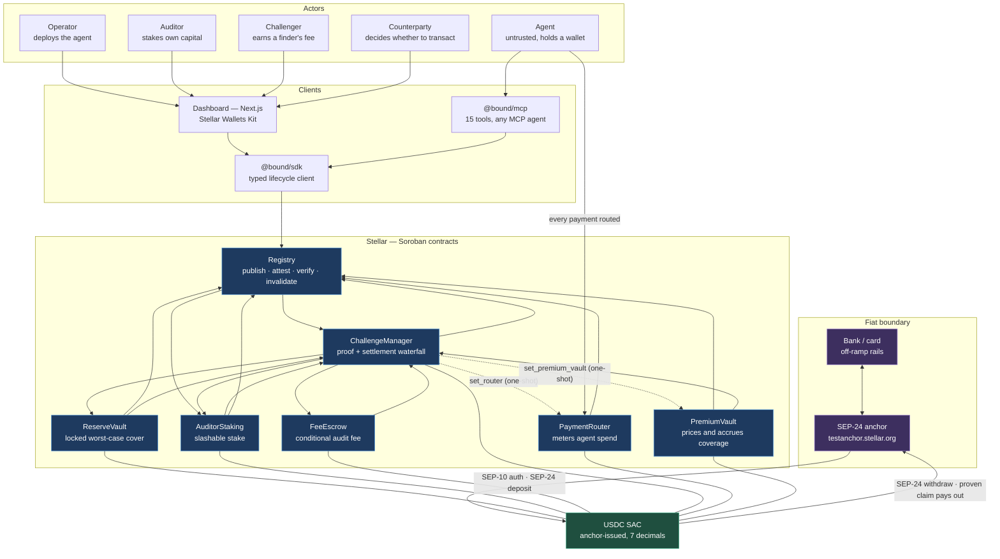
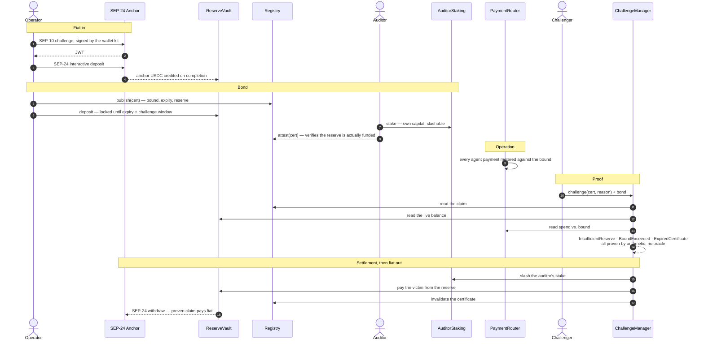

# Architecture

> Seven Soroban contracts, one asset, and the rail that connects them to fiat.
> Every contract ID below is live on Stellar testnet and linked to the explorer.

---

## System

**The one edge that is new for this hackathon** is the dotted fiat boundary at the top.
Everything below it was deployed and verified before; the anchor turns Bound's reserve
from a mock token into money a person can put in and take out.

---

## Lifecycle — fiat in, proof, fiat out

Three of the four challenge reasons are **trustless** — the contract reads the
certificate's claim against live on-chain state and settles without an arbiter.
Only `FakeSignature` needs one.

---

## Deployments

Bound runs as two independent deployments of the same contracts, differing only
in which token they hold.

|                                                | Asset                   | Purpose                                                                         |
| ---------------------------------------------- | ----------------------- | ------------------------------------------------------------------------------- |
| **v2** (`deployments/testnet.json`)            | mock USDC `CDIQ4564…`   | the stable deployment behind the live app, the SDK and the InstAward record     |
| **anchor** (`deployments/testnet-anchor.json`) | anchor USDC `CBIELTK6…` | this hackathon — the same protocol, holding money the anchor issues and redeems |

They are separate on purpose. The anchor work never redeploys over contract IDs
that the docs site, the npm package and an approved grant SOW already cite.

### Scaling to the anchor's limits

The reference anchor caps every transfer at 10 units. The v2 scenario assumes
`AUDITOR_MIN_STAKE = 500` and `CHALLENGE_MIN_BOND = 100`, which nobody can fund
out of a max-10 deposit. Rather than hardcode a second set of constants,
`BOUND_AMOUNT_SCALE` divides every USDC figure in the deploy and demo scripts by
one factor, so every ratio the assertions depend on survives — `DE_MINIMIS_FLOOR_BPS`
is in basis points, so it scales with the bound rather than against it. Unset,
every existing script behaves exactly as before.

---

## Stellar skill files used

<!-- TODO before submission: replace with the exact paths you consulted -->

| Skill file                | Where it shows up                                                    |
| ------------------------- | -------------------------------------------------------------------- |
| `skills/anchors/SKILL.md` | SEP-10 / SEP-24 flow in `scripts/anchor-deposit.ts`                  |
| `skills/wallets/SKILL.md` | Stellar Wallets Kit wiring in `apps/dashboard/app/lib/wallet/kit.ts` |
| `skills/soroban/SKILL.md` | contract build target and deploy sequence in `scripts/deploy-all.ts` |
